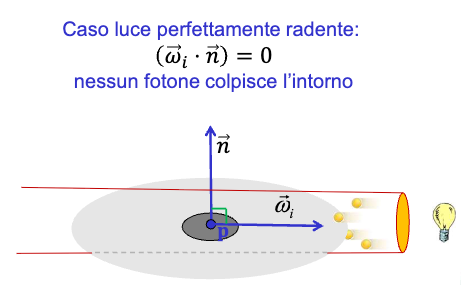

# Lighting

## In breve

- problema locale: quanta luce riceve un intorno di superficie;
- legge del coseno di Lambert e clamp per luce da dietro;
- equazione della radianza e ruolo di BRDF e ambiente di illuminazione;
- assunzioni semplificatrici per il real-time e modello lambertiano;
- estensione a colori RGB e somma di piu luci;
- sorgenti direzionali vs posizionali e attenuazione con la distanza;
- dove si calcola il lighting nel pipeline;
- note pratiche di uso in three.js.

## 1) Sottoproblema locale: quanta luce riceve la superficie

Se dalla direzione di arrivo $\omega_i$ arrivano $L$ lumen, quanta luce riceve un intorno di superficie in $\mathbf{p}$ con normale $\mathbf{n}$?

Caso radente:

- se $\omega_i \cdot \mathbf{n} = 0$, la luce è tangente e non colpisce l'intorno.
    
    
    

Caso da dietro:

- se $\omega_i \cdot \mathbf{n} < 0$, la superficie è nella sua ombra: il contributo è $0$.
    
    
    

Legge del coseno di Lambert:

$$

L_{recv} = L \max(0, \omega_i \cdot \mathbf{n})

$$

## 2) Luce emessa e luce riflessa

La radianza osservata da $\mathbf{p}$ lungo una direzione $\omega$ è somma di:

- luce emessa dalla superficie (solo per oggetti auto-emissivi);
- luce riflessa dalla superficie.

Forma generale:

$$

L(\mathbf{p}, \omega) = L_e(\mathbf{p}, \omega) + L_r(\mathbf{p}, \omega)

$$


## 3) Equazione della radianza (forma generale)

La luce riflessa integra tutti i contributi incidenti dalla semisfera $\Omega$ visibile dal punto $\mathbf{p}$:

$$

L_r(\mathbf{p}, \omega) = \int_{\Omega} f(\mathbf{p}, \omega_i, \omega)\, L(\mathbf{p}, \omega_i)\, \max(0, \omega_i \cdot \mathbf{n})\, d\omega_i

$$

Significato operativo:

- $L(\mathbf{p}, \omega_i)$ descrive l'ambiente di illuminazione;
- $f(\mathbf{p}, \omega_i, \omega)$ è la BRDF del materiale nel punto $\mathbf{p}$;
- il termine $\omega_i \cdot \mathbf{n}$ implementa la legge del coseno.


## 4) Materiali uniformi e non uniformi

Materiali non uniformi:

- la BRDF cambia punto per punto sulla superficie;
- la variazione può essere codificata per vertice o con una texture.

Materiali uniformi:

- la BRDF è costante sulla superficie e il punto $\mathbf{p}$ può essere omesso.


## 5) Assunzioni semplificatrici per il real-time

Per rendere il calcolo pratico in tempo reale:

1. Materiale uniforme.
2. BRDF lambertiana (puramente diffusiva) con costante $D$ (albedo).
3. Luci discrete, poche direzioni $\omega_i$.

La forma risultante per una luce:

$$

L_o = D\, L_i\, \max(0, \omega_i \cdot \mathbf{n})

$$

Per $N$ luci si sommano i contributi:

$$

L_o = \sum_{i=1}^{N} D\, L_i\, \max(0, \omega_i \cdot \mathbf{n})

$$

## 6) Estensione a colori RGB (base color)

In pratica si lavora per canali RGB.
La forma vettoriale usa il prodotto componente per componente (Hadamard):

$$

\mathbf{C} = \sum_{i=1}^{N} (\mathbf{D} \otimes \mathbf{L}_i)\, \max(0, \omega_i \cdot \mathbf{n})

$$

Dove:

- $\mathbf{D}$ è il base color (diffuse color) del materiale;
- $\mathbf{L}_i$ è intensità e colore della luce $i$-esima.


## 7) Additività e saturazione

Osservazioni pratiche:

- senza luci, il colore risultante e' $(0,0,0)$;
- il lighting è additivo: si sommano i contributi di ogni luce;
- molte luci portano velocemente alla saturazione verso il bianco.

## 8) Sorgenti direzionali e posizionali

Due modelli comuni:

- luce direzionale: direzione costante in tutta la scena;
- luce posizionale: la direzione dipende dal punto illuminato.

Per luce posizionale:

$$

\omega_i = \frac{\mathbf{p}{light} - \mathbf{p}}{\lVert \mathbf{p}{light} - \mathbf{p} \rVert}

$$


## 9) Attenuazione con la distanza (falloff/decay)

Per luci posizionali, l'intensità decresce con la distanza $d$:

$$

F_{att} = \frac{1}{d^{k}}

$$

Note:

- fisicamente, $k = 2$;
- valori minori di 2 rendono l'attenuazione più morbida;
- $k = 0$ implica nessuna attenuazione.

## 10) Dove si calcola il lighting nel pipeline

Il lighting tipicamente è calcolato per frammento (per-pixel lighting):

- le normali vengono trasformate nello spazio scelto (vista o mondo);
- il rasterizer interpola le normali per frammento;
- il fragment shader applica l'equazione di lighting.

Punto chiave:

- tutti i vettori dell'equazione (normale, direzione luce, direzione vista)
devono essere nello stesso spazio.


## 11) Note pratiche in three.js

Esempio essenziale:

```jsx
// 1. rendere il materiale un materiale lambertiano
var materiale = new THREE.MeshLambertMaterial();
materiale.color.setRGB(r,g,b); // base color

// 2. creiamo luci e le aggiungiamo alla scena
var luceA = new THREE.DirectionalLight();
luceA.color.setRGB(1,1,1); // intensità della luce
luceA.position.set(.4,1,.3); // direzione
scena.add(luceA);

var luceB = new THREE.PointLight();
luceB.position.set(2,1.5,5);
luceB.decay = 2; // falloff fisico
scena.add(luceB);
```

Rif. `lab06.hmtl`

## 12) Riepilogo essenziale

- La legge del coseno di Lambert determina quanta luce colpisce la superficie.
- La radianza generale integra i contributi dell'emisfera con BRDF e coseno.
- Il modello lambertiano assume BRDF costante e poche luci discrete.
- La versione RGB usa il prodotto componente per componente con il base color.
- Le luci possono essere direzionali o posizionali, con attenuazione a distanza.
- Il lighting si calcola di norma nel fragment shader, con vettori nello stesso spazio.

## 13) Domande guida per il ripasso

- Perché il contributo della luce è zero quando $\omega_i \cdot \mathbf{n} < 0$?
- Quali termini compaiono nell'equazione della radianza e che ruolo hanno?
- Quali assunzioni portano dal modello generale al modello lambertiano?
- Come cambia l'equazione quando si passa al colore RGB?
- Qual è la differenza tra luce direzionale e posizionale?
- In che fase del pipeline si calcola il lighting e perché?